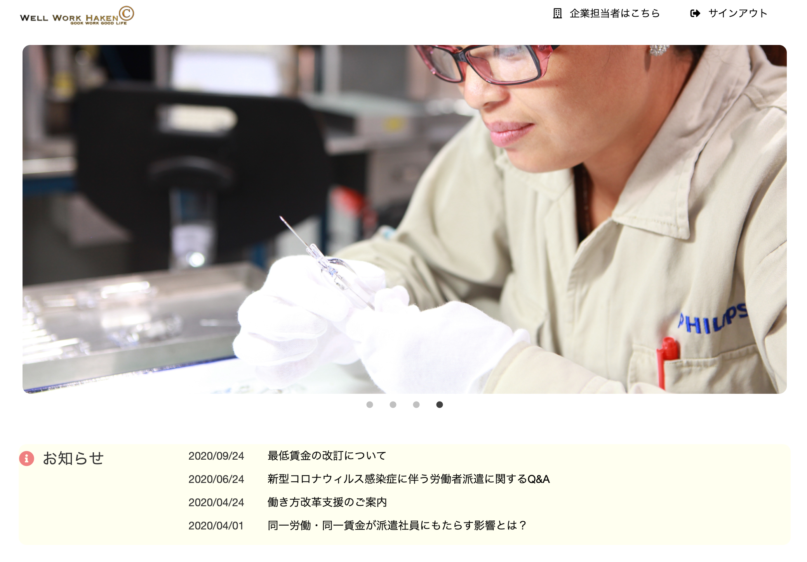

# Well-work
#### クチコミ機能がついている派遣サイトです。 中途採用等では企業のクチコミサイトが多く存在していますが、派遣社員向けの企業のクチコミなどはあまりないと実感しサイトを制作しました。 中途／新卒採用で候補者が選考企業の情報を収集しながら入社を決定できるように、派遣の活用を「労働力の提供」としてではなく、派遣社員が派遣先をもっと選びやすいようにしたいと思います。クチコミの活用で派遣社員が企業を選びやすくするのではなく、企業が派遣社員に対する見方を変えるきっかけになればという思いで作成しました。

|求人情報|クチコミ画面|
|---|---|
|||

## 使用技術
* ruby 2.6.5
* Rails 6.0.3.3
* MySQL 5.7
* AWS
 * EC2
* HAML/SCSS
* jQuery/javascript

## URL
(http://18.180.198.199/) 
下記のログイン情報をご参考いただけます。
* メールアドレス ： tarou@gmail.com
* パスワード    ： tttttttt

## 機能一覧
 * 新規登録・ログイン機能（Device）
 * 気になる（Ajax）
 * ページネーション（kaminari）
 * モーダルウィンドウ（クチコミ機能）
 * スライダー（jQuery）
 * 検索機能
   
## 工夫点
*
*
*

## 反省点
*
*
*
